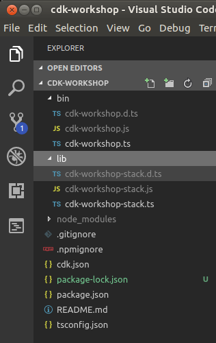

+++
title = "Project structure"
weight = 300
+++

## Open your IDE

Now's a good time to kick off your IDE and explore our little project.

If you use VSCode, you can just type:

```s
$ cd cdk-workshop
$ code .
```

## Explore your project directory

You'll see something like this:



* __`bin/cdk-workshop.ts`__ is the entrypoint of your CDK application.
* `package.json` is your npm module manifest. It includes information like the
  name of your app, version, dependencies and build scripts like "watch" and
  "build" (`package-lock.json` is maintained by npm)
* `cdk.json` tells the toolkit how to run your app. In our case it will be
  `"node bin/cdk-workshop.js"`
* `tsconfig.json` your project's [typescript
  configuration](https://www.typescriptlang.org/docs/handbook/tsconfig-json.html)
* `.gitignore` and `.npmignore` tell git and npm which files to include/exclude
  from source control and when publishing this module to the package manager.
* `node_modules` is maintained by npm and includes all your project's
  dependencies.

## Your app's entry point

Let's open up `bin/cdk-workshop.ts`:

```ts
import sns = require('@aws-cdk/aws-sns');
import sqs = require('@aws-cdk/aws-sqs');
import cdk = require('@aws-cdk/cdk');

class CdkWorkshopStack extends cdk.Stack {
  constructor(parent: cdk.App, name: string, props?: cdk.StackProps) {
    super(parent, name, props);

    const queue = new sqs.Queue(this, 'CdkWorkshopQueue', {
      visibilityTimeoutSec: 300
    });

    const topic = new sns.Topic(this, 'CdkWorkshopTopic');

    topic.subscribeQueue(queue);
  }
}

const app = new cdk.App();
new CdkWorkshopStack(app, 'CdkWorkshopStack');
app.run();
```

As you can see, our app was created with a sample CDK stack
(`CdkWorkshopStack`).The stack includes:

- SQS Queue (`new sqs.Queue`)
- SNS Topic (`new sns.Topic)`
- Subscribes the queue to receive any messages published to the topic (`subscribeQueue`).
