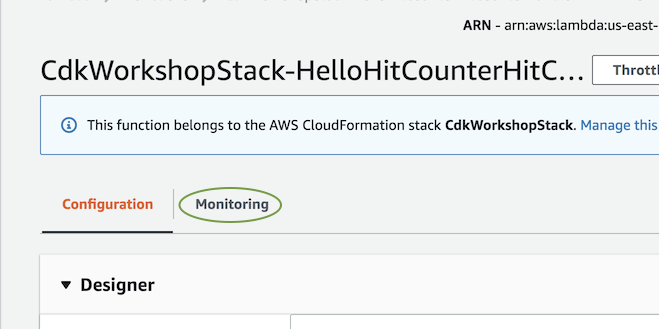
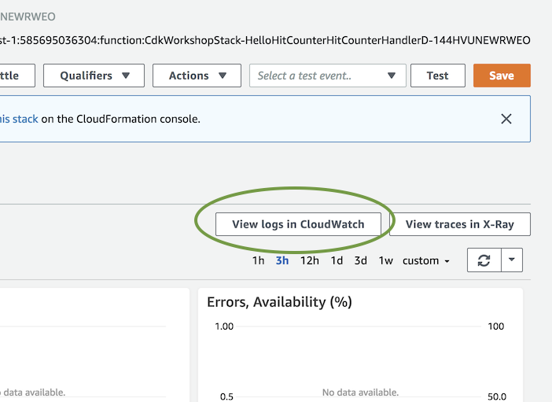
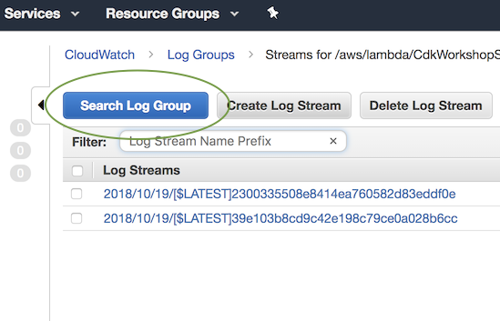

+++
title = "CloudWatch Logs"
weight = 500
+++

The first thing to do is to go and look at the logs of your AWS Lambda function.
There are many tools that help you do that like [SAM
CLI](https://github.com/awslabs/aws-sam-cli) and
[awslogs](https://github.com/jorgebastida/awslogs). In this workshop, we'll show you how
to find your logs through the AWS console.

1. Open the [AWS Lambda console](https://console.aws.amazon.com/lambda/home). Make sure you
   are connected to the correct region.
2. Click on the "HitCounter" Lambda function:

    

3. Click on __Monitoring__

    

4. Click on __View on CloudWatch Logs__. This will open the AWS CloudWatch console.

    

5. Click __Search Log Group__

    

6. Scroll all the way down, and look for an error. You'll likely see something like this:


    ```json
    {
        "errorMessage": "User: arn:aws:sts::585695036304:assumed-role/CdkWorkshopStack-HelloHitCounterHitCounterHandlerS-TU5M09L1UBID/CdkWorkshopStack-HelloHitCounterHitCounterHandlerD-144HVUNEWRWEO is not authorized to perform: dynamodb:UpdateItem on resource: arn:aws:dynamodb:us-east-1:585695036304:table/CdkWorkshopStack-HelloHitCounterHits7AAEBF80-1DZVT3W84LJKB",
        "errorType": "AccessDeniedException",
        "stackTrace": [
            "Request.extractError (/var/runtime/node_modules/aws-sdk/lib/protocol/json.js:48:27)",
            "Request.callListeners (/var/runtime/node_modules/aws-sdk/lib/sequential_executor.js:105:20)",
            "Request.emit (/var/runtime/node_modules/aws-sdk/lib/sequential_executor.js:77:10)",
            "Request.emit (/var/runtime/node_modules/aws-sdk/lib/request.js:683:14)",
            "Request.transition (/var/runtime/node_modules/aws-sdk/lib/request.js:22:10)",
            "AcceptorStateMachine.runTo (/var/runtime/node_modules/aws-sdk/lib/state_machine.js:14:12)",
            "/var/runtime/node_modules/aws-sdk/lib/state_machine.js:26:10",
            "Request.<anonymous> (/var/runtime/node_modules/aws-sdk/lib/request.js:38:9)",
            "Request.<anonymous> (/var/runtime/node_modules/aws-sdk/lib/request.js:685:12)",
            "Request.callListeners (/var/runtime/node_modules/aws-sdk/lib/sequential_executor.js:115:18)"
        ]
    }
    ```

Okay, this is starting to make sense. It seems like our Lambda function can't
write to our DynamoDB table. Which, kind of makes sense. We didn't actually
grant it these permissions.

To fix this problem, go back to `hitcounter.ts` and add the following:


import cdk = require('@aws-cdk/cdk');
import lambda = require('@aws-cdk/aws-lambda');
import dynamodb = require('@aws-cdk/aws-dynamodb');

export interface HitCounterProps {
  /** the function for which we want to count url hits **/
  downstream: lambda.FunctionRef;
}

export class HitCounter extends cdk.Construct {
  /** allows accessing the counter function */
  public readonly handler: lambda.Function;

  constructor(parent: cdk.Construct, id: string, props: HitCounterProps) {
    super(parent, id);

    const table = new dynamodb.Table(this, 'Hits');
    table.addPartitionKey({ name: 'path', type: dynamodb.AttributeType.String });

    this.handler = new lambda.Function(this, 'HitCounterHandler', {
      runtime: lambda.Runtime.NodeJS810,
      handler: 'hitcounter.handler',
      code: lambda.Code.directory('lambda'),
      environment: {
        DOWNSTREAM_FUNCTION_NAME: props.downstream.functionName,
        HITS_TABLE_NAME: table.tableName
      }
    });

    // grant the lambda role read/write permissions to our table
    table.grantReadWriteData(this.handler.role);
  }
}


Save & deploy:

```s
$ cdk deploy
```

Okay, deployment is complete. Let's run our test again:

```s
$ curl -I https://xxxxxxxxxx.execute-api.us-east-1.amazonaws.com/prod/
HTTP/1.1 502 Bad Gateway
```

# 😢

Still getting those pesky 500s. Let's take another look at our CloudWatch logs (click "Refresh"):

```json
{
    "errorMessage": "User: arn:aws:sts::585695036304:assumed-role/CdkWorkshopStack-HelloHitCounterHitCounterHandlerS-TU5M09L1UBID/CdkWorkshopStack-HelloHitCounterHitCounterHandlerD-144HVUNEWRWEO is not authorized to perform: lambda:InvokeFunction on resource: arn:aws:lambda:us-east-1:585695036304:function:CdkWorkshopStack-HelloHandler2E4FBA4D-149MVAO4969O7",
    "errorType": "AccessDeniedException",
    "stackTrace": [
        "Object.extractError (/var/runtime/node_modules/aws-sdk/lib/protocol/json.js:48:27)",
        "Request.extractError (/var/runtime/node_modules/aws-sdk/lib/protocol/rest_json.js:52:8)",
        "Request.callListeners (/var/runtime/node_modules/aws-sdk/lib/sequential_executor.js:105:20)",
        "Request.emit (/var/runtime/node_modules/aws-sdk/lib/sequential_executor.js:77:10)",
        "Request.emit (/var/runtime/node_modules/aws-sdk/lib/request.js:683:14)",
        "Request.transition (/var/runtime/node_modules/aws-sdk/lib/request.js:22:10)",
        "AcceptorStateMachine.runTo (/var/runtime/node_modules/aws-sdk/lib/state_machine.js:14:12)",
        "/var/runtime/node_modules/aws-sdk/lib/state_machine.js:26:10",
        "Request.<anonymous> (/var/runtime/node_modules/aws-sdk/lib/request.js:38:9)",
        "Request.<anonymous> (/var/runtime/node_modules/aws-sdk/lib/request.js:685:12)"
    ]
}
```

Another access denied, but this time, if you take a close look:

```
User: X is not authorized to perform: lambda:InvokeFunction on resource: Y"
```

So it seems like our hit counter actually managed to write to the database. We can confirm by
going to the [DynamoDB Console](https://console.aws.amazon.com/dynamodb/home):


But, we must also give our hit counter permissions to invoke the downstream lambda function:


import cdk = require('@aws-cdk/cdk');
import lambda = require('@aws-cdk/aws-lambda');
import dynamodb = require('@aws-cdk/aws-dynamodb');

export interface HitCounterProps {
  /** the function for which we want to count url hits **/
  downstream: lambda.FunctionRef;
}

export class HitCounter extends cdk.Construct {
  /** allows accessing the counter function */
  public readonly handler: lambda.Function;

  constructor(parent: cdk.Construct, id: string, props: HitCounterProps) {
    super(parent, id);

    const table = new dynamodb.Table(this, 'Hits');
    table.addPartitionKey({ name: 'path', type: dynamodb.AttributeType.String });

    this.handler = new lambda.Function(this, 'HitCounterHandler', {
      runtime: lambda.Runtime.NodeJS810,
      handler: 'hitcounter.handler',
      code: lambda.Code.directory('lambda'),
      environment: {
        DOWNSTREAM_FUNCTION_NAME: props.downstream.functionName,
        HITS_TABLE_NAME: table.tableName
      }
    });

    // grant the lambda role read/write permissions to our table
    table.grantReadWriteData(this.handler.role);

    // grant the lambda role invoke permissions to the downstream function
    props.downstream.grantInvoke(this.handler.role);
  }
}


You can check what this did to `cdk diff`:

```s
$ cdk diff
[~] 🛠 Updating HelloHitCounterHitCounterHandlerServiceRoleDefaultPolicy1487A60A (type: AWS::IAM::Policy)
 └─ [~] .PolicyDocument:
     └─ [~] .Statement:
         ├─ [-] Old value: [{"Action":["dynamodb:BatchGetItem","dynamodb:GetRecords","dynamodb:GetShardIterator","dynamodb:Query","dynamodb:GetItem","dynamodb:Scan","dynamodb:BatchWriteItem","dynamodb:PutItem","dynamodb:UpdateItem","dynamodb:DeleteItem"],"Effect":"Allow","Resource":{"Fn::GetAtt":["HelloHitCounterHits7AAEBF80","Arn"]}}]
         └─ [+] New value: [{"Action":["dynamodb:BatchGetItem","dynamodb:GetRecords","dynamodb:GetShardIterator","dynamodb:Query","dynamodb:GetItem","dynamodb:Scan","dynamodb:BatchWriteItem","dynamodb:PutItem","dynamodb:UpdateItem","dynamodb:DeleteItem"],"Effect":"Allow","Resource":{"Fn::GetAtt":["HelloHitCounterHits7AAEBF80","Arn"]}},{"Action":"lambda:InvokeFunction","Effect":"Allow","Resource":{"Fn::GetAtt":["HelloHandler2E4FBA4D","Arn"]}}]
```

You can see that the following IAM statement was added to the role:

```json
{
  "Action":"lambda:InvokeFunction",
  "Effect":"Allow",
  "Resource":{"Fn::GetAtt":["HelloHandler2E4FBA4D","Arn"]}
}
```

Which is exactly what we wanted.

Okay... let's give this another shot:

```s
$ cdk deploy
...
$ curl -I https://xxxxxxxxxx.execute-api.us-east-1.amazonaws.com/prod/

```