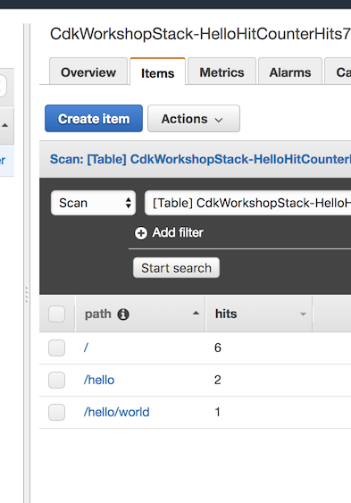

+++
title = "Test the hit counter"
weight = 700
+++

## Issue a few test requests

Let's issue a few requests and see if our hit counter works. You can also use
your web browser to do that:

```
$ curl https://xxxxxxxxxx.execute-api.us-east-1.amazonaws.com/prod/
$ curl https://xxxxxxxxxx.execute-api.us-east-1.amazonaws.com/prod/
$ curl https://xxxxxxxxxx.execute-api.us-east-1.amazonaws.com/prod/hello
$ curl https://xxxxxxxxxx.execute-api.us-east-1.amazonaws.com/prod/hello/world
$ curl https://xxxxxxxxxx.execute-api.us-east-1.amazonaws.com/prod/hello/world
```

## Open DynamoDB console

1. Now, go to the [DynamoDB console](https://console.aws.amazon.com/dynamodb/home)
2. Open our table and select "Items"

    

## Good job!

The cool thing about our `HitCounter` is that it's quite useful. It basically
allows anyone to "attach" it to any Lambda function that serves as an API
Gateway proxy backend and it will log hits to this API.

Since our hit counter is a simple JavaScript class, you could package it into an
npm module and publish it to [npmjs.org](http://npmjs.org/), which is the
JavaScript package manager. Then, anyone could `npm install` it and add it to
their CDK apps.

-----

In the next chapter we will be __consuming__ a construct library published to
npm, which will allow us to view the contents of our hit counter table from any
browser.