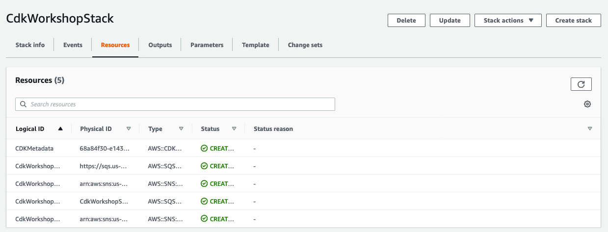

+++
title = "cdk deploy"
weight = 500
+++

Okay, we've got a CloudFormation template. What's next? __Let's deploy it into our account!__

## Bootstrapping an environment

The first time you deploy an AWS CDK app into an environment (account/region),
you'll need to install a "bootstrap stack". This stack includes resources that
are needed for the toolkit's operation. For example, the stack includes an S3
bucket that is used to store templates and assets during the deployment process.

You can use the `cdk bootstrap` command to install the bootstrap stack into an
environment:

```
cdk bootstrap
```

Then:

```
 ⏳  Bootstrapping environment 123456789012/us-west-2...
...
```

{}
If you are returned an Access Denied message at this step, verify that
you have [configured the AWS CLI correctly]((/15-prerequisites/200-account.html)) (or, specified an appropriate secret/access key), and also verify that you have permission to call `cloudformation:CreateChangeSet` within the scope of your [account/session](https://docs.aws.amazon.com/cli/latest/userguide/cli-configure-profiles.html)
{}

## Let's deploy

Use `mvn package` to compile the code, then `cdk deploy` to deploy a CDK app:

```
mvn package
cdk deploy
```

You will first be informed of security-related changes that the CDK is going to perform on your behalf, if there are any security-related changes

```
This deployment will make potentially sensitive changes according to your current security approval level (--require-approval broadening).
Please confirm you intend to make the following modifications:

IAM Statement Changes
┌───┬────────────────────────────────┬────────┬─────────────────┬────────────────────────────────┬────────────────────────────────┐
│   │ Resource                       │ Effect │ Action          │ Principal                      │ Condition                      │
├───┼────────────────────────────────┼────────┼─────────────────┼────────────────────────────────┼────────────────────────────────┤
│ + │ ${CdkWorkshopQueue.Arn}        │ Allow  │ sqs:SendMessage │ Service:sns.amazonaws.com      │ "ArnEquals": {                 │
│   │                                │        │                 │                                │   "aws:SourceArn": "${CdkWorks │
│   │                                │        │                 │                                │ hopTopic}"                     │
│   │                                │        │                 │                                │ }                              │
└───┴────────────────────────────────┴────────┴─────────────────┴────────────────────────────────┴────────────────────────────────┘
(NOTE: There may be security-related changes not in this list. See https://github.com/aws/aws-cdk/issues/1299)

Do you wish to deploy these changes (y/n)?
```

This is warning you that deploying the app entails some risk.
Since we need to allow the topic to send messages to the queue,
enter **y** to deploy the stack and create the resources.

Output should look like the following, where ACCOUNT-ID is your account ID, REGION is the region in which you created the app,
and STACK-ID is the unique identifier for your stack:

```
CdkWorkshopStack: deploying...
CdkWorkshopStack: creating CloudFormation changeset...


 ✅  CdkWorkshopStack

Stack ARN:
arn:aws:cloudformation:REGION:ACCOUNT-ID:stack/CdkWorkshopStack/STACK-ID
```

## The CloudFormation Console

CDK apps are deployed through AWS CloudFormation. Each CDK stack maps 1:1 with
CloudFormation stack.

This means that you can use the AWS CloudFormation console in order to manage
your stacks.

Let's take a look at the [AWS CloudFormation
console](https://console.aws.amazon.com/cloudformation/home).

You will likely see something like this (if you don't, make sure you are in the correct region):


If you select `CdkWorkshopStack` and open the __Resources__ tab, you will see the
physical identities of our resources:



# I am ready for some actual coding!
