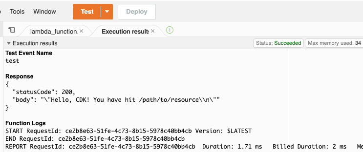

+++
title = "Hello Lambda"
weight = 200
+++

## Lambda handler code

まず、Lambda handlerのコードから記述します。

1. プロジェクトツリーのルート (`cdk_workshop`ディレクトリの隣) に `lambda` ディレクトリを作成します。
2. `lambda/hello.py` という名前のファイルを作成し、以下のコードを追加します。

```python
import json

def handler(event, context):
    print('request: {}'.format(json.dumps(event)))
    return {
        'statusCode': 200,
        'headers': {
            'Content-Type': 'text/plain'
        },
        'body': 'Hello, CDK! You have hit {}\n'.format(event['path'])
    }
```
これは __"Hello, CDK! You've hit [url path]"__ を返す単純な Lambda 関数です。HTTP ステータスコードと HTTP ヘッダーが付加された HTTP レスポンスとしてユーザーに応答するために、API Gateway を使用します。

{} この Lambda 関数 は Python で実装されています。その他の言語での実装については[AWS Lambda のドキュメント](https://docs.aws.amazon.com/ja_jp/lambda/latest/dg/welcome.html)を参照してください。
{}

## AWS Lambda コンストラクトライブラリをインストールする

AWS CDK には、__AWS Construct Library__ と呼ばれるコンストラクトのための様々なライブラリが付属しています。AWS Construct Library は、AWS サービスごとに 1 つずつ、__モジュール__ として提供されます。たとえば、AWS Lambda 関数を定義する場合、AWS Lambda の Construct Library を使用する必要があります。

AWS コンストラクトについて学ぶには、[AWS Construct Library reference](https://docs.aws.amazon.com/cdk/api/v2/docs/aws-construct-library.html) を参照してください。


## コピー＆ペーストは使わずに書いてみましょう

このワークショップでは、コピー&ペーストをするのではなく、CDK のコードを入力することを強く推奨します（入力する量は多くありません）こうすることで、CDK の使い方を十分に理解することができます。IDE がオートコンプリート、インラインドキュメント、およびタイプセーフに対応しているのを実際に確認してください。


## AWS Lambda 関数をスタックに追加する

`cdk_workshop/cdk_workshop_stack.py` の先頭に `import` ステートメントを追加し、`Lambda.Function` をスタックに追加します。



from constructs import Construct
from aws_cdk import (
    Stack,
    aws_lambda as _lambda,
)

class CdkWorkshopStack(Stack):

    def __init__(self, scope: Construct, id: str, **kwargs) -> None:
        super().__init__(scope, id, **kwargs)

        # Defines an AWS Lambda resource
        my_lambda = _lambda.Function(
            self, 'HelloHandler',
            runtime=_lambda.Runtime.PYTHON_3_7,
            code=_lambda.Code.from_asset('lambda'),
            handler='hello.handler',
        )


注意すべき点がいくつかあります。

- `lambda` は Python のビルトイン識別子であるため、`aws_lambda` モジュールを `_lambda` としてインポートしています。
- この関数は Python 3.7 ランタイムを使用しています。
- ハンドラーコードは、先ほど作成した `lambda` ディレクトリからロードされます。パスは、プロジェクトのルートディレクトリである `cdk` を実行した場所からの相対パスです。
- ハンドラー関数の名前は `hello.handler` です (「hello」はファイルの名前で、「handler」は関数名です)

## コンストラクト(constructs)とコンストラクター(constructors)について

ご覧のとおり、`CDKWorkshopStack`と `Lambda.Function`の両方の（および CDK 内の他の多くの）コンストラクタークラスには、`（スコープ、id、**kwargs）`というシグネチャがあります。これは、これらのクラスがすべて __コンストラクト__ であるため、CDK アプリの基本的な構成要素となっています。それらは抽象的な「クラウドコンポーネント」を表し、スコープを介してより高いレベルの抽象化にまとめることができます。スコープにはコンストラクトを含めることができ、そのコンストラクトには他のコンストラクトなどを含めることができます。

コンストラクトは常に別のコンストラクトのスコープ内に作成され、作成されたスコープ内で一意でなければならない識別子を常に持つ必要があります。したがって、コンストラクト初期化子 (コンストラクター) は常に次のシグネチャを持ちます。

1. __`scope`__: 最初の引数は常に、このコンストラクトが作成されるスコープです。ほとんどの場合、_現在_ のスコープ内でコンストラクトを定義することになります。つまり、通常は最初の引数に `self` を渡すだけです。
2. __`id`__: 二番目の引数はコンストラクトの __ローカルID__ です。これは、同じスコープ内のコンストラクトの中で一意でなければならないIDです。CDK はこの ID を使用して、このスコープ内で定義された各リソースの CloudFormation [論理 ID](https://docs.aws.amazon.com/AWSCloudFormation/latest/UserGuide/resources-section-structure.html) を計算します。CDK の ID の詳細については [CDK ユーザーマニュアル](https://docs.aws.amazon.com/cdk/latest/guide/identifiers.html#identifiers_logical_ids) を参照してください。
3. __`kwargs`__: 最後の (時にはオプションの) 引数は、初期化プロパティのセットです。これらは各コンストラクトに依存です。例えば、`Lambda.Function` 構文は `runtime`、`code`、`handler`のようなプロパティを受け入れます。IDE のオートコンプリートを使用するか、[オンラインドキュメント](https://docs.aws.amazon.com/cdk/api/latest/docs/aws-lambda-readme.html) でさまざまなオプションを調べることができます。

## Diff

コードを保存し、デプロイする前に差分を見てみましょう。

```
cdk diff
```

出力は次のようになります。

```
The cdk-workshop stack uses assets, which are currently not accounted for in the diff output! See https://github.com/awslabs/aws-cdk/issues/395
IAM Statement Changes
┌───┬────────────────────────┬────────┬────────────────────────┬────────────────────────┬───────────┐
│   │ Resource               │ Effect │ Action                 │ Principal              │ Condition │
├───┼────────────────────────┼────────┼────────────────────────┼────────────────────────┼───────────┤
│ + │ ${HelloHandler/Service │ Allow  │ sts:AssumeRole         │ Service:lambda.amazona │           │
│   │ Role.Arn}              │        │                        │ ws.com                 │           │
└───┴────────────────────────┴────────┴────────────────────────┴────────────────────────┴───────────┘
IAM Policy Changes
┌───┬─────────────────────────────┬─────────────────────────────────────────────────────────────────┐
│   │ Resource                    │ Managed Policy ARN                                              │
├───┼─────────────────────────────┼─────────────────────────────────────────────────────────────────┤
│ + │ ${HelloHandler/ServiceRole} │ arn:${AWS::Partition}:iam::aws:policy/service-role/AWSLambdaBas │
│   │                             │ icExecutionRole                                                 │
└───┴─────────────────────────────┴─────────────────────────────────────────────────────────────────┘
(NOTE: There may be security-related changes not in this list. See http://bit.ly/cdk-2EhF7Np)

Parameters
[+] Parameter HelloHandler/Code/S3Bucket HelloHandlerCodeS3Bucket4359A483: {"Type":"String","Description":"S3 bucket for asset \"hello-cdk-1/HelloHandler/Code\""}
[+] Parameter HelloHandler/Code/S3VersionKey HelloHandlerCodeS3VersionKey07D12610: {"Type":"String","Description":"S3 key for asset version \"hello-cdk-1/HelloHandler/Code\""}
[+] Parameter HelloHandler/Code/ArtifactHash HelloHandlerCodeArtifactHash5DF4E4B6: {"Type":"String","Description":"Artifact hash for asset \"hello-cdk-1/HelloHandler/Code\""}

Resources
[+] AWS::IAM::Role HelloHandler/ServiceRole HelloHandlerServiceRole11EF7C63
[+] AWS::Lambda::Function HelloHandler HelloHandler2E4FBA4D
```

ご覧のとおり、このコードは __AWS::Lambda::Function__ 用の CloudFormation テンプレートを生成しました。ハンドラーコードの場所を伝達するために、ツールキットが利用する [CloudFormation パラメータ](https://docs.aws.amazon.com/cdk/latest/guide/get_cfn_param.html)が生成されています。

## デプロイ

次にデプロイをしましょう。

```
cdk deploy
```
`cdk deploy` を実行すると、CloudFormation スタックをデプロイするだけでなく、初期構築した S3 バケットに対して、ローカルの `lambda` ディレクトリを圧縮後、アップロードしていることが分かります。

## 関数のテスト

AWS Lambda コンソールに移動して、Lambda 関数をテストしましょう。

1. [AWS Lambda Console](https://console.aws.amazon.com/lambda/home#/functions) を開きます。(正しいリージョンにいることを確認してください)

    Lambda 関数が表示されます。

    

2. 関数名をクリックして、コンソールを移動します。

3. __Test__ ボタンをクリックして、 __テストイベントを設定__ ダイアログが開きます。

    

4. __テンプレート__ リストから __API Gateway AWS Proxy__ を選択します。

5. __イベント名__ に `test` を入力します。

    

6. 下にスクロールして、 __保存__ をクリック。

7. __Test__ をもう一度クリックし、実行が完了するまで待ちます。

8. __Execution results__ ペインで出力が表示されます。

    

# 👏
